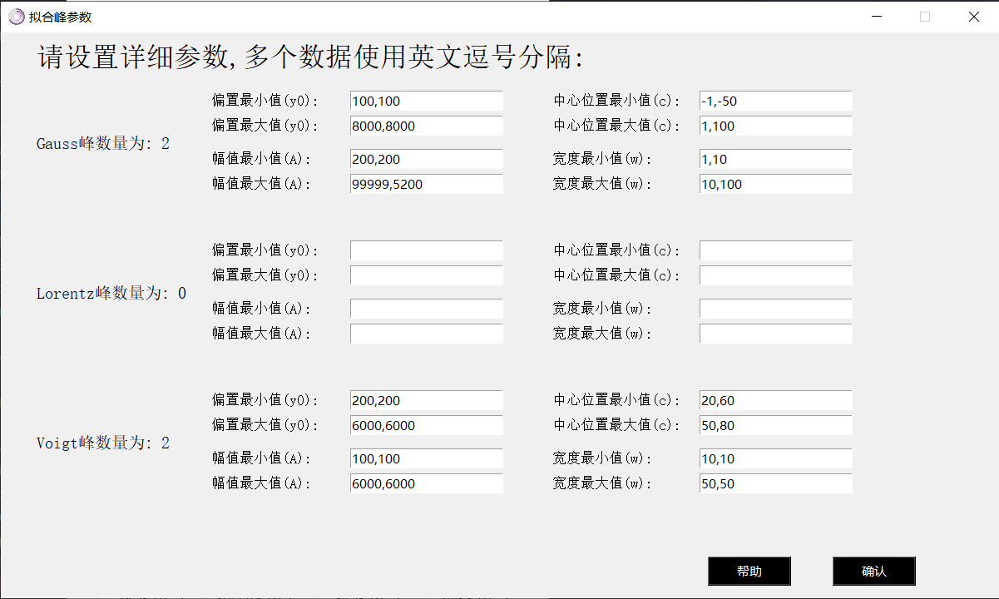
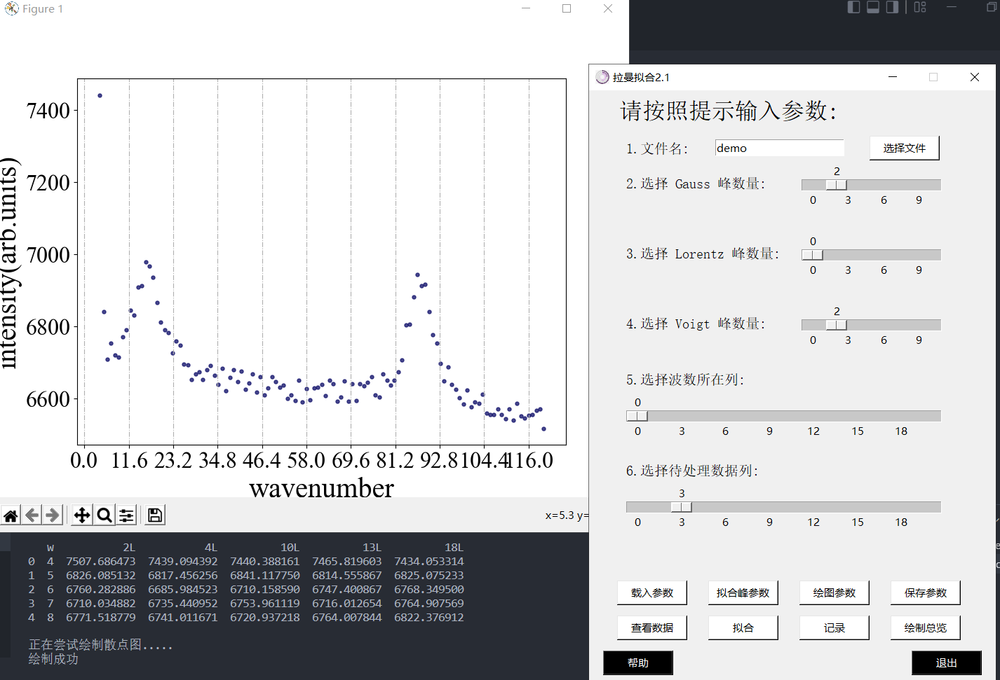

# 基于python的拉曼多峰拟合画图程序

# 拉曼拟合

## 0.主界面介绍

    </img>

主界面一共有6个可调节参数：
1. 文件名
2. gauss峰数量
3. lorentz峰数量
4. voigt峰数量
5. 波数所在列
6. 待处理数据列

8个功能按钮：
1. 载入参数
2. 拟合峰参数
3. 绘图参数
4. 保存参数
5. 查看数据
6. 拟合
7. 记录
8. 绘制总览

3个其他按钮
1. 选择文件
2. 帮助
3. 退出

## 1.六个可调节参数

### 1.1 文件名

文件要求utf-8格式保存的csv文件，内容样式可以参加下图。

使用excel另存为一下就可以满足条件。

    </img>

输入的名称不需要加后缀，同路径下文件只需输入名称，非同路径下文件需要输入绝对路径。也可以使用后面的按键直接选择文件。

### 1.2 三个峰数量

多峰拟合程序可以拟合多个峰，光谱的峰一般为这三种更多内容可见[谱线展宽和线型函数](https://splendidwave.github.io/2022/01/26/2022-1/%E8%B0%B1%E7%BA%BF%E5%B1%95%E5%AE%BD%E5%92%8C%E7%BA%BF%E5%9E%8B%E5%87%BD%E6%95%B0/)

通过滑块可以分别选择这三个峰的数量，最终拟合函数为这些峰的和。

### 1.3 波数所在列

即横坐标所在列，拉曼光谱图像横坐标为拉曼频移，单位为波数

### 1.4 待处理数据列

即纵坐标所在列，拉曼光谱图像纵坐标为强度，通常无单位，绘制散点图和单幅拟合时，需要选中待处理数据。

## 2.八个按钮

### 2.1 “载入参数”按钮

点击该按钮会弹出当前路径的窗口。

所有参数保存为.npz格式。

在该窗口中可以选择.npz后缀的文件进行参数读取。

### 2.2 “拟合峰参数”按钮

点击该按钮会弹出一个子窗口，如下

    </img>

该窗口左侧显示3个峰的数量。注意参数不要超出该数目。

每个峰会有4个参数（偏置，幅值，中心位置，半高宽）
在该窗口可以设置每个峰的拟合范围（最大值和最小值）

可以先通过点击“绘制散点图”按钮大致观察峰存在的范围然后依次输入。

如果拟合曲线有多个相同峰，如4个高斯峰，则在Gauss输入框中按顺序写下4个峰的参数，中间用英文逗号分割。

点击帮助会在控制台输出上述文字。

点击确认会记录输入的参数。

### 2.3 “绘图参数”按钮

    </img>

主要按照python绘图规则输入参数。子峰前面的复选框取消勾选就不会绘制子峰。具体配置参看[使用python进行科研绘图](https://splendidwave.github.io/2022/01/30/2022-1/%E4%BD%BF%E7%94%A8python%E8%BF%9B%E8%A1%8C%E7%A7%91%E7%A0%94%E7%BB%98%E5%9B%BE/).

点击帮助没什么用。

点击确认会记录输入的参数。

### 2.4 “保存参数”按钮

点击该按钮会弹出当前路径的窗口。您可以保存您当前设定的参数包括主界面参数和拟合峰参数，自定义名字，可以是中文，不需要加后缀。

### 2.5 “查看数据”按钮

点击该按钮会尝试读取文件。输出共有多少列，并输出前5行，可以用于检测是否读取到了正确的数据文件。

最后会根据参数5、6绘制散点图。

    </img>

### 2.6 “拟合”按钮

点击该按钮会根据所有参数进行数据拟合并显示图片。

    </img>

### 2.7 “记录”按钮

点击该按钮会临时记录本次拟合的结果参数，并有相关提示。

关闭程序数据会清空。

### 2.8 “绘制总览”按钮

点击该按钮会将临时记录的数据绘制在一张图中。

    </img>

## 3.三个其他按钮

### 3.1 选择文件
输入文件可以通过在框内输入文件名和点击选择文件按钮两种方式输入。

### 3.2 帮助

点击该按钮会给出一些帮助，可能也没啥用。

### 3.3 退出

点击该按钮会退出程序，在这之前会先询问一下你是否需要保存参数。选择是在你下次打开该程序后还是会显示当前设置过的参数。

## 4.附件

程序下载地址：https://github.com/splendidwave/Raman_fit
