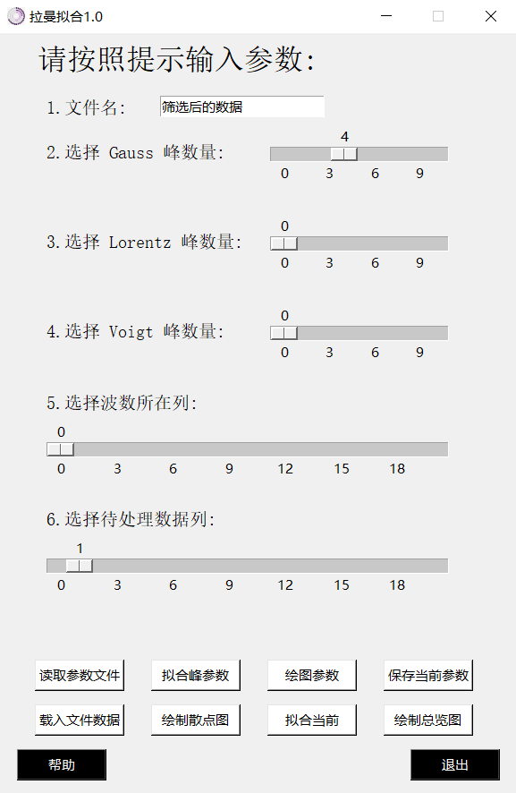

# 拉曼拟合
## 0.主界面介绍

    </img>

主界面一共有6个可调节参数：
1. 文件名
2. gauss峰数量
3. lorentz峰数量
4. voigt峰数量
5. 波数所在列
6. 待处理数据列

8个功能按钮：
1. 读取参数文件
2. 拟合峰参数
3. 绘图参数
4. 保存当前参数
5. 载入文件数据
6. 绘制散点图
7. 拟合当前
8. 绘制总览图

2个其他按钮
1. 帮助
2. 退出

## 1.六个可调节参数

### 1.1 文件名

文件要求utf-8格式保存的csv文件，内容样式可以参加下图。

使用excel另存为一下就可以满足条件。

    </img>

输入的名称不需要加后缀，同路径下文件只需输入名称，非同路径下文件需要输入绝对路径。

### 1.2 三个峰数量

多峰拟合程序可以拟合多个峰，光谱的峰一般为这三种更多内容可见[谱线展宽和线型函数](https://splendidwave.github.io/2022/01/26/2022-1/%E8%B0%B1%E7%BA%BF%E5%B1%95%E5%AE%BD%E5%92%8C%E7%BA%BF%E5%9E%8B%E5%87%BD%E6%95%B0/)

通过滑块可以分别选择这三个峰的数量，最终拟合函数为这些峰的和。

### 1.3 波数所在列

即横坐标所在列，拉曼光谱图像横坐标为拉曼频移，单位为波数

### 1.4 待处理数据列

即纵坐标所在列，拉曼光谱图像纵坐标为强度，通常无单位，绘制散点图和单幅拟合时，需要选中待处理数据。

点击绘制所有会绘制除选中列外的所有数据，如不想忽略该列，可以将滑块拨到和波数所在列相同的位置。

## 2.八个按钮

上四个为参数调节及其保存读取

下四个为数据处理及图像输出

### 2.1 “读取参数文件”按钮

点击该按钮会弹出当前路径的窗口。

所有参数保存为.npz格式

在该窗口中可以选择.npz后缀的文件进行参数读取。

### 2.2 “拟合峰参数”按钮

点击该按钮会弹出一个子窗口，如下

    </img>

该窗口左侧显示3个峰的数量。注意参数不要超出该数目。

每个峰会有4个参数（偏置，幅值，中心位置，半高宽）
在该窗口可以设置每个峰的拟合范围（最大值和最小值）

可以先通过点击“绘制散点图”按钮大致观察峰存在的范围然后依次输入。

如果拟合曲线有多个相同峰，如4个高斯峰，则在Gauss输入框中按顺序写下4个峰的参数，中间用英文逗号分割。

### 2.3 “绘图参数”按钮

尚未完成开发，可以进入setting.py手动修改

### 2.4 “保存当前参数”按钮

点击该按钮会弹出当前路径的窗口。您可以保存您当前设定的参数包括主界面参数和拟合峰参数，自定义名字，可以是中文，不需要加后缀。

### 2.5 “载入文件数据”按钮

点击该按钮会尝试读取文件。并输出前5行，可以用于检测是否读取到了正确的数据文件

### 2.6 “绘制散点图”按钮

点击该按钮会根据参数5、6绘制散点图

### 2.7 “拟合当前”按钮

点击该按钮会根据参数5、6拟合数据

### 2.8 “绘制总览图”按钮

尚未完成开发

## 3.两个其他按钮

### 3.1 帮助

点击该按钮会给出一些帮助，可能也没啥用

### 3.2 退出

点击该按钮会退出程序，在这之前会先询问一下你是否需要保存参数。
